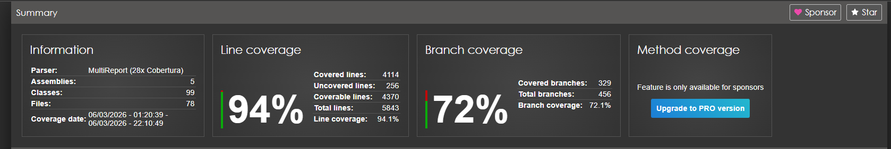

# Sistema de Compra Programada de Ações - Itaú Corretora

Este é um sistema que desenvolvi integralmente para o desafio técnico da Itaú Corretora. O projeto automatiza o investimento recorrente em uma carteira recomendada ("Top Five"), gerenciando desde a adesão do cliente e captura de cotações até o rebalanceamento automático com apuração tributária precisa.

## Arquitetura e Estrutura do Sistema

- **Banco de Dados:** MySQL 8.0
- **Mensageria:** Apache Kafka (Disponibilizado via Docker, tópico `ir-events`)
- **Arquitetura:** Clean Architecture + DDD (Domain-Driven Design)
Eu projetei a solução utilizando os princípios da **Clean Architecture** e **Domain-Driven Design (DDD)**. Essa escolha permitiu que as regras de negócio fossem isoladas de preocupações tecnológicas, facilitando a manutenção e a evolução do sistema.

### Camadas do Projeto

- **Itau.CompraProgramada.Domain**: Esta é a camada central e mais importante do sistema. Nela, eu defini as entidades de negócio (como Cliente, Custódia, Rebalanceamento e Cotacao), objetos de valor (como CPF), enums e exceções de domínio. Também declarei nesta camada as interfaces de repositórios e serviços de domínio, garantindo que o núcleo da aplicação não dependa de frameworks externos.

- **Itau.CompraProgramada.Application**: Nesta camada, eu implementei os serviços que orquestram a lógica da aplicação. É aqui que os casos de uso são realizados, como a adesão ao produto, a alteração de valores de aporte e a consulta de rentabilidade. Eu utilizei DTOs (Data Transfer Objects) para definir os contratos de entrada e saída, mantendo as entidades de domínio protegidas.

- **Itau.CompraProgramada.Infrastructure**: Eu utilizei esta camada para tratar de todos os detalhes técnicos e integrações externas. Ela contém a implementação do Entity Framework Core 9 para persistência no MySQL, incluindo mapeamentos fluentes e migrações. Também implementei aqui o processador de arquivos de cotação da B3 e a **integração com o Apache Kafka** para publicação de eventos de IR.

- **Itau.CompraProgramada.API**: Representa a porta de entrada do sistema. Eu desenvolvi os controllers REST seguindo padrões de mercado e configurei o Swagger para documentação. É nesta camada que configurei o **Composition Root**, incluindo middlewares para tratamento global de erros e a integração do motor de compra.

- **Itau.CompraProgramada.Worker**: O motor de processamento automático é uma peça fundamental. Desenvolvi a API para exposição dos contratos e integrei o motor de compra como um serviço hospedado (Hosted Service). O Worker monitora diariamente a chegada de novos arquivos de cotação da B3, processando-os para manter os preços do sistema sempre atualizados. Além disso, ele monitora o calendário e, nos dias agendados (5, 15 e 25), realiza automaticamente as operações de distribuição de ativos e rebalanceamento da carteira master.

## Estratégia de Testes

Para garantir a confiabilidade de um sistema financeiro, eu estabeleci uma estratégia de testes dividida em duas grandes categorias:

### Testes de Unidade (Unit Tests)
Foquei estes testes na lógica pura do sistema. Eu validei exaustivamente as entidades de domínio, garantindo que as regras de negócio (como validações de CPF e cálculos de preço médio) funcionem isoladamente. Também cobri todos os DTOs e serviços da camada de aplicação, utilizando mocks para as dependências externas. O objetivo aqui foi garantir a correção da lógica de decisão e cálculos sem a necessidade de infraestrutura real.

### Testes de Integração (Integration Tests)
Eu desenvolvi estes testes para validar a comunicação entre o software e os componentes externos. Para garantir fidelidade total ao ambiente de produção e evitar surpresas com dialetos de banco de dados, utilizo **TestContainers** para subir uma instância real do **MySQL** em Docker durante a execução dos testes. Isso permite validar o ciclo de vida real das entidades, o processo de seed inicial e o fluxo completo dos controllers da API em um ambiente idêntico ao real.

#### Resultado De testes do Sistema:


## Decisões Técnicas

- **Automação Tributária (RN-055)**: Configurei o disparo imediato de eventos de IR (Dedo-Duro) para o Kafka em todas as operações de venda durante o rebalanceamento.
- **Ingestão Diária de Cotações**: Implementei uma rotina no Worker que busca arquivos no formato `COTAHIST_D<DDMMYYYY>.TXT`. Isso simula uma integração real onde a corretora recebe arquivos diários da B3 para atualizar sua base de preços e disparar o motor de investimento.
- **Cálculo de Lucro Real (RN-060)**: Eu implementei um mecanismo que rastreia o lucro real em cada operação de venda. Diferente de uma abordagem baseada em estimativas, eu capturo a diferença exata entre o preço de venda e o preço médio, garantindo precisão total no cálculo do imposto de renda mensal enviado ao Kafka.

- **Gestão de Custódia Master (RN-030)**: Eu projetei o sistema para lidar com o resíduo de quantidades fracionárias decorrentes da distribuição proporcional entre clientes. Esse saldo residual é mantido na Conta Master e utilizado automaticamente nas operações futuras, otimizando o uso de capital.

## Como Executar

### Pré-requisitos
- Docker e Docker Compose.
- SDK do .NET 9.

### 1. Iniciar a Infraestrutura
Na raiz do projeto, execute:
```bash
docker-compose up -d
```

### 2. Executar a Aplicação
Navegue até a pasta `src` e execute a API. O motor de processamento iniciará automaticamente:
```bash
dotnet run --project Itau.CompraProgramada.API
```
*Acesse o Swagger em: http://localhost:5000/swagger*

#### 3. Execução de Testes e Geração de Relatório de Cobertura

Para garantir a qualidade do sistema e visualizar quais partes do código estão sendo testadas, siga este passo a passo didático para gerar o relatório de cobertura em HTML:

#### Passo 1: Instalar a ferramenta de geração de relatórios
 Instale o `reportgenerator` globalmente:
```bash
dotnet tool install -g dotnet-reportgenerator-globaltool
```

#### Passo 2: Executar os testes coletando dados de cobertura
Usando o comando `dotnet test` apontando para a solução (`src/Itau.CompraProgramada.sln`) e adicionando o parâmetro `--collect:"XPlat Code Coverage"`. Isso gera arquivos `.xml` com os dados brutos de cobertura em pastas temporárias dentro de `TestResults`.
```bash
dotnet test src/Itau.CompraProgramada.sln --collect:"XPlat Code Coverage"
```

#### Passo 3: Consolidar os dados e gerar o relatório HTML
Usando o `reportgenerator` para buscar todos os arquivos `.xml` gerados no passo anterior e criar um relatório único e amigável na pasta `tests/coveragereport`.
```bash
reportgenerator -reports:"**/coverage.cobertura.xml" -targetdir:"tests/coveragereport" -reporttypes:Html
```

#### Passo 4: Visualizar o resultado
Abra o arquivo gerado no seu navegador:
- Navegue até: `tests/coveragereport/index.html`

---
Desenvolvido por Mateus para o Desafio de Engenharia de Software - Itaú Corretora.
